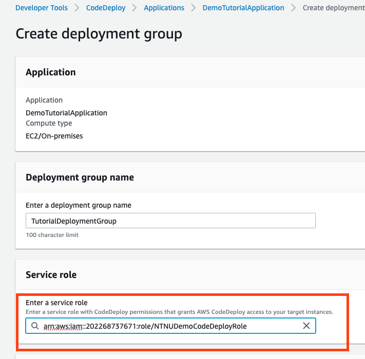
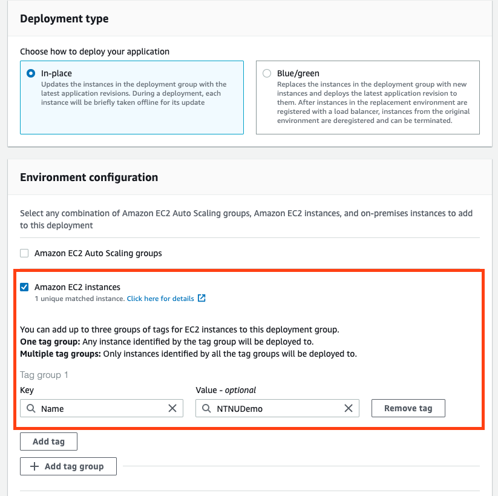
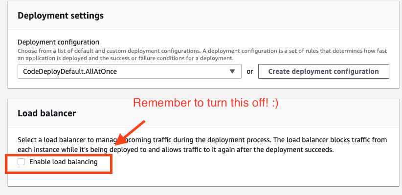
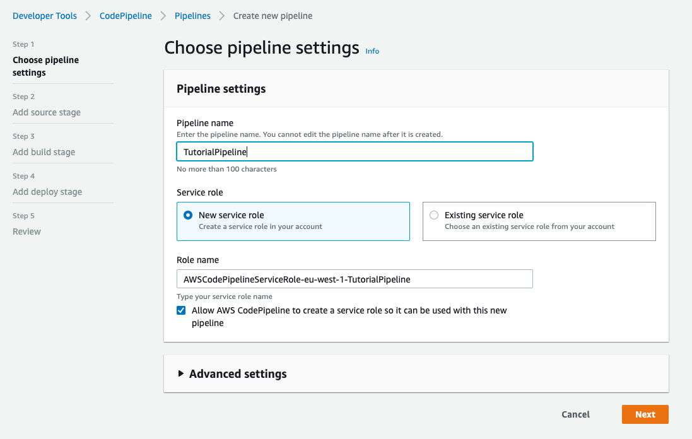
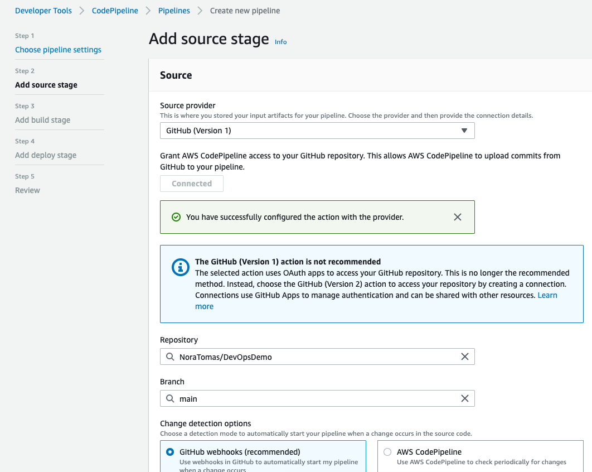
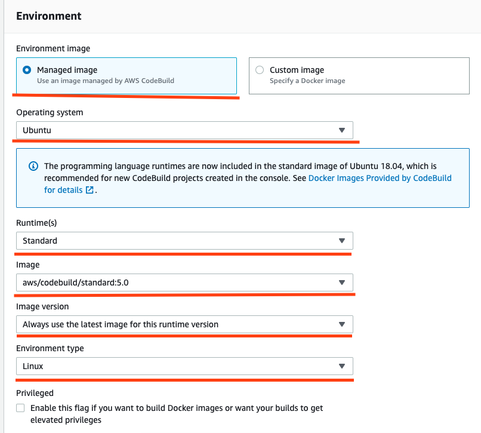

# DevOpsDemo

This is a demo project to learn how a pipeline works. 
Try deploying the demo to an AWS EC2 instance by using AWS CodePipeline, 
CodeBuild and CodeDeploy. 

Follow the steps below to deploy the code. 

## Step 1: Create a VM
Create a virtual machine on AWS called an "EC2 instance". 
Read the steps in [this guide](https://docs.aws.amazon.com/AWSEC2/latest/UserGuide/EC2_GetStarted.html) to get started.
Or just google "Create EC2 AWS" to find other guides you might perfer :) 

**NB!** It is very important that you tag your VM. The tags is what the pipeline
will use to deploy to the correct VMs. You can add tags after you have
created the EC2 (as in the image below):


## Step 2: Give your VM a role
Create an IAM role for the EC2 machine. The IAM role needs to have the 
following policy:
*AmazonEC2RoleforAWSCodeDeploy*. It will give your EC2 the right permissions
allowing you to deploy code to the machine. To learn how to create an IAM
role and policy use [this guide](https://docs.aws.amazon.com/codedeploy/latest/userguide/getting-started-create-iam-instance-profile.html).

Use the part saying "Create an IAM instance profile for your 
Amazon EC2 instances (console)". You can create your own policy
as the guide says. Or you can use a policy created by AWS already,
in this case *AmazonEC2RoleforAWSCodeDeploy*.  

IAM roles and policies are difficult to understand in the beginning! 
Don't get discouraged if it does not make any sense :) 

## Step 3: Install Java on the VM
Your VM is a clean slate right now. It is like a new computer that has
almost nothing installed on it. In order to run the jar file deployed to
it you need to install Java. 

Connect to your EC2 and use the following command to install Java:
`sudo amazon-linux-extras install java-openjdk11`

If you don't know how to SSH to an EC2 use
[this guide](https://docs.aws.amazon.com/AWSEC2/latest/UserGuide/ec2-instance-connect-methods.html).

## Step 4: Install the CodeDeploy agent on your VM
In addition to Java, you need something called a "CodeDeploy agent"
to be able to do deployments. 

Install the agent using the following commands.
These commands assume you are running Amazon Linux on your VM and
that you are in the EU West 1 region (like Ireland). 

```
sudo yum install ruby

sudo yum install wget

cd /home/ec2-user

wget https://aws-codedeploy-eu-west-1.s3.eu-west-1.amazonaws.com/latest/install

chmod +x ./install

sudo ./install auto

```

Use this command to make sure your CodeDeploy agent is runnign:

```
sudo service codedeploy-agent status
```

## Step 5: Learn what files AWS needs to deploy
AWS needs some files that exist in this project to know how to
deploy your code. 
The *appspec.yml* file is used by the deployment part of the
pipeline called **CodeDeploy**. *buildspec.yml* is used by
the build part of the pipeline called **CodeBuild**. 

We will also have some scripts in the /scripts directory. 
These scripts will run on the EC2 at different times. 
The start_server.sh script starts the JAR file and runs after the
code has been deployed. cleanup.sh is run first, and it deletes the
JAR files that already exist on the virtual machine. 
fix_priviliges.sh makes sure that all files have the correct priviliges so
that they can be executed. stop_server.sh is used to kill any java process
already running that could interfere with running the new JAR. 

## Step 6: Create the CodeDeploy part of the pipeline!
* In AWS you first need to go to the CodeDeploy service. Search for CodeDeploy on
AWS. Then start by clicking "Applications" in the CodeDeploy side menu and create
a new application. Pick "EC2/On-premise" for compute platform.

* Now go to the IAM service and create a role again. This is the role that you will give
to the CodeDeploy deployment group. Usually you would want to be careful about permissions
and only give the CodeDeploy deployment group the permissions it really needs. 
However, since this is not a real production environment you can just give the deployment
group admin rights. Here is how the admin rights IAM policy looks like:

```
{
    "Version": "2012-10-17",
    "Statement": [
        {
            "Effect": "Allow",
            "Action": "*",
            "Resource": "*"
        }
    ]
}
```

CAUTION: Admin rights should not be given to services 
in real life :) it is a typical security vulnerability. You can experiment a bit
with this policy and try to make it more specific. 
 

* After creating your IAM role go back to CodeDeploy and find the application you
created. Start making a new deployment group. In the "Enter a service role"-step pick
the IAM role that you just created (see image below).



* Pick "in-place" deployment type

* In "Environment Configuration" pick "Amazon EC2 instances". 
Here you will have to refer to a Tag group. A tag group
means that you have to tell CodeDeploy what EC2 machines you
want it to deploy to (see image below):



* You can leave all the other options as default except one. When you get to the
load balancer part, remember to switch off "enable load balancing" (see image below)

* This deployment group uses the files in /scripts of this project. It also uses
appspec.yml for configuration. So study these files carefuly! :) On a different 
project you would have to change these files for things to work. 



## Step 7: Create the CodePipeline and CodeBuild parts of the pipeline!

* Go to the CodePipeline service in AWS and click on "Create a new pipeline"

* For CodePipeline you can let AWS create an IAM role for you. So you can pick
"New service role" instead of creating an IAM role (see image below):



* On the second step "Add source stage" connect to your GitHub account. Choose
the repository and branch you want to deploy (see image below)



* On the "Add build stage" part pick AWS CodeBuild and click on "Create Project" 
(see image below). This will take you to a new window where you will create a 
CodeBuild project. The CodeBuild project is basically what runs commands such as
"mvn build" that let you create the JAR-file. You can find the commands that CodeBuild
will run in buildspec.yml

 

* Pick the following options for CodeBuild (see image below)



* In the textbox where you have to pick a Role ARN create another IAM role with
admin priviliges and assign it. 

* After you create the CodeBuild project pick it in CodePipeline. Leave everything
as default for the rest. Except, in the "Add Deploy Stage" you have to pick the 
CodeDeploy project you created.

Hopefully the pipeline should now work! :)


